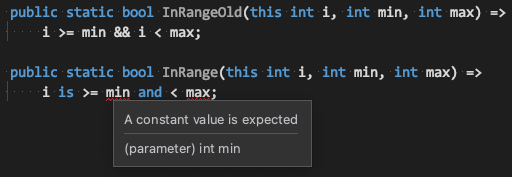

이번에 릴리즈된 C# 9.0의 기능을 살펴봤다. 

MS Docs [링크](https://docs.microsoft.com/ko-kr/dotnet/csharp/whats-new/csharp-9)에 워낙 잘 설명돼있어서 기능에 대한 설명 자체는 자세히 다루지 않겠다.

### record type

새로운 `Reference Type`이 추가되었다.

몰랐는데, class 만 reference type 인줄 알았는데 익명 타입도 reference type에 포함된다고 한다.

어차피 C# 컴파일러가 익명 타입을 class로 변환할 것 같지만..

<html>
<script src="https://gist.github.com/penspanic/e25ebe8c3b2eef1e2fc01e6f9cbaa962.js"></script>
</html>

역시 그렇다. 내부적으론 `Tuple<,>` 등과 비슷하게 구현됐다고 보면 될 것 같음.

#### 내가 생각하는 도입 사유

기존의 class(reference type)으로 immutable type을 구현하기 좀 까다로웠다.

```csharp
public class LegacyImmutableType
{
    public int IntProperty { get; }
    public readonly string StringField;
    public LegacyImmutableType(int intValue, string stringValue)
    {
        IntProperty = intValue;
        StringField = stringValue;
    }
}
```
이런 식으로 getter만 있는 Property를 구현하거나, readonly 키워드를 필드에 사용해 `mutable`함을 막았다.  
이 방식은 `readonly struct`와 다르게 Immutable Type으로써 의도가 불명확하고, 불편하다.

이 애로사항을 해결하기 위한 점이 `record` 도입의 가장 큰 사유가 아닐까 싶다.

---

### Init only setters

정말 필요했던 기능이다.  
기존의 `{ get; }`만 존재하는 Property의 경우 생성자내에서 초기화가 완료돼야 하고,  
`object initializer`([링크](https://docs.microsoft.com/ko-kr/dotnet/csharp/programming-guide/classes-and-structs/how-to-initialize-objects-by-using-an-object-initializer)) 내에서 초기화가 불가능하다.

```csharp   
public class InitOnlySetterSample
{
    public string GetterOnlyProperty { get; }
    public string InitOnlyProperty { get; init; }

    public InitOnlySetterSample Create()
    {
        // 컴파일 에러!
        var a = new InitOnlySetterSample() {GetterOnlyProperty = "###"};

        // 컴파일 가능!
        var b = new InitOnlySetterSample() {InitOnlyProperty = "###"};
        return a;
    }
}
```

이게 가능해짐으로써 좀더 유연하게 객체 초기화를 진행할 수 있게 됐다.  
object initializer의 편의성은 다들 알테니 편의성 개선에 공감할 수 있을거라 생각한다.

---

### Top-level statements

Main 메서드를 별도로 정의하지 않고, 모듈(class, struct 등)에 포함돼지 않은 최상단 코드를
Main 메서드로 인식하게 하는 기능이다.

단순한 기능의 프로그램에 유용할거라고는 한다. 구조화된 중규모 이상의 프로그램을 만드는 입장에선 크게 와닿지는 않는다.

---

### Pattern matching enhancements

```csharp
public static class CSharpNinePatternMatching
    {
        public static bool IsLetter(this char c) =>
            c is >= 'a' and <= 'z' or >= 'A' and <= 'Z';
    }
```
*Doc 예제.*

is, and, or 키워드를 사용할 수 있는 범위가 늘어난 것 같고..

하나의 문제를 해결할 수 있는 여러가지 문법적 방법이 나오고 있어, 코딩 컨벤션이 더더욱 중요해질 듯 하다.



!.. 위와 같은 로직을 단순화하길 바랬는데 상수값에만 적용되는 use case 가 있는 듯 하다.  

---

### Performance and interop
#### native ints

System.Int32는 이름에서 유추 가능하듯 32비트 정수 자료형이다.  
C / C++ 에서와 다르게 .Net에서의 int는 아키텍쳐에 상관없이 고정 크기이다.

그에 반면 이번에 나온 nint(native int) 와 기존의 System.IntPtr은 C / C++ 처럼 아키텍쳐에 따라 자료형 크기가 달라진다.

performance critical한 시나리오에서 활용해야 하고, 웬만한 상황에선 안쓰는 게 나아보인다.  
괜히 .Net integer가 4 bytes 고정 크기인 게 아닐 거다.

.Net interop 시나리오에서 활용 가능할 듯.

#### function pointers

대략 C style 함수포인터랑 비슷해보인다.

```csharp
public class DelegateSample
{
    public delegate int Bar(int a, int b);

    private static int BarMethod(int a, int b) a + b;

    public static void InvokeDelegate()
    {
        Bar bar = BarMethod;
        int returnValue = bar.Invoke(1, 2);
    }

    public static unsafe void InvokeFunctionPointer()
    {
        delegate*<int, int, int> fp = &BarMethod;
        int returnValue = fp(1, 2);
    }
}
```

System.Delegate의 보다 오버헤드가 적다고 하고,
managed 호출 규약 외에 stdcall, cdecl등 별도의 호출 규약을 지정할 수 있다.  
-> 이를 통해 .Net interop 이 조금 더 편해지려나 싶은데.. 앞으로 이쪽 다뤄볼 일이 얼마나 있을까 싶다..

#### localsinit 스킵

이번에 C# 9 기능 알아보면서 한 가지 알아낸 사실이 있다.

> .Net에서는 로컬 변수값이 0값으로 초기화 됩니다~

라는 기능을 수행하는 위치가 어디인지. 바로 `localsinit` 지시어다.

상황에 따라 해당 초기화 로직이 굳이 필요 없는 오버헤드로 작용할 수 있기에, 해당 기능을 Skip 하도록 하는 기능이다.  
만.. 내 현재 환경에서 현재 컴파일 후 디컴파일 해봐도 적용이 안되는 것을 보아 나중에 다시 봐야 할 듯.

---

### Fit and finish features

추론 가능한 타입이 있을 때 `new()` 로 할당하는 것 좋구요. 잘 쓸 듯.

local function에 Attribute를 붙일 수 있다던가 기타 등등. 아직 크게 와 닿진 않는다.

---

### Support for code generators

code generator가 내가 아는 그 것이 맞는지 모르겠어서 찾아봤더니,  

[code generator 설명](https://devblogs.microsoft.com/dotnet/introducing-c-source-generators/)


컴파일 과정에 코드 생성을 진행하고, 컴파일이 재개되도록 하는 기능을 말하는 것이었음.

이전엔 별도로 코드 생성을 실행하고, 컴파일 하는 과정을 거쳤는데  
이 방법을 사용하게 된다면 자동화 되어 훨씬 간편할 듯 하다. 당장 도입해보고 싶다.

좀 찾아봤더니 코드 생성 프로젝트를 분리하고, 다른 프로젝트에서 해당 프로젝트를 참조하는 식으로 구현해야 되는 것 같다.

뭐 암튼. code generator 기능 확장이 살짝 이뤄졌다고 한다.