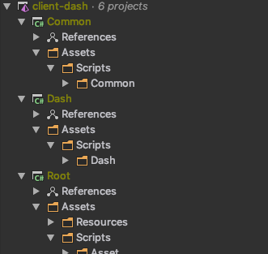

# Unity - Assembly Definition

## 요약

---

Assembly를 나누어, 모듈별 의존성을 명확하게 관리하고, 컴파일 시간을 줄인다.

## 내용

---

기본 Unity 컴파일 시스템은 2개의 Assembly를 만들어낸다.

프로젝트 안 소스파일들이 기본적으로 Assembly-CSharp에 포함되고,
"Editor" 란 이름의 Directory안의 소스파일들은 Assembly-Csharp-Editor에 포함된다.

결국, 특정 소스코드를 1줄만 수정을 해도 그 소스코드가 포함된 어셈블리를 다시 컴파일 해야 한다. 이 과정에서 프로젝트가 커지고, 모듈이 많이 붙을 수록 **컴파일 시간이 길어진다.**

이 문제를 해결할 수 있는 기능이 Unity 2018에 추가된 **Assembly Definition** 기능이다.

[스크립트 컴파일 및 어셈블리 정의 파일(Script compilation and assembly definition files) - Unity 매뉴얼](https://docs.unity3d.com/kr/2018.1/Manual/ScriptCompilationAssemblyDefinitionFiles.html)

## 기타

---

컴파일 타임과 상관없이 모듈화하여 종속성 관리하는 것 자체도 구조적으로 올바르기 때문에  
이 기능을 적용하고 잘 사용해야 할 필요성이 있다.

---
예전에 회사 노션에 작성했던 내용인데, 블로그에 옮긴다.